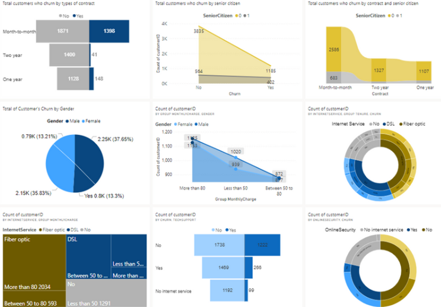

# Customer Churn Dashboard

📌 Project Overview --> This project analyzes customer churn in the telecommunications sector to identify key factors influencing why customers leave their service providers. Using a dataset of 5,986 users from Kaggle, we explored customer demographics, service usage, payment methods, and contract types to uncover actionable insights for retention strategies. The dashboard was developed in Power BI to provide the Telco company’s management with a visual, interactive tool for monitoring churn patterns and planning interventions.

Source - The dataset is taken from Kaggle: https://www.kaggle.com/datasets/blastchar/telco-customer-churn  
--> This project is part of my final group assignment during degree and full report can be accessed here: https://www.canva.com/design/DAEdf7T9Ga8/9JMITJLstO5gc-YeCCnJVg/view?utm_content=DAEdf7T9Ga8&utm_campaign=designshare&utm_medium=link&utm_source=editor#37  
--> Disclaimer - PBIX file no longer accessible due to expiration Power BI student license. Hence, this repository contains only the project report and analysis details.

🎯 Project Objectives

1. Identify factors contributing to customer churn.
2. Determine which service areas need improvement to retain customers.
3. Develop actionable strategies to reduce churn and attract new customers.
4. Build a data visualization system to explore churn patterns interactively.

🛠 Tools & Technologies Used

1. Power BI – Dashboard creation and visualization.
2. Power Query (ETL Tool) – Data transformation.
3. DAX (Data Analysis Expressions) – measure calculations.

📊 Data Highlights

1. 5,986 records and 21 attributes including demographics, service types, tenure, payment methods, and churn status.
2. Created derivative attributes such as:
   1. Group Monthly Charges (Less than 50, Between 50–80, More than 80)
   2. Group Tenure (New, Middle, Old customers)

🔍 Key Analyses & Insights
1. Contract Type & Churn
   1. Month-to-month contracts have the highest churn rates.
   2. Shorter commitment periods lead to easier switching to competitors.

2. Customer Demographics
   1. Non-senior citizens churn more than senior citizens.
   2. Shorter contract durations among younger customers increase churn risk.

3. Gender & Churn
   1. Gender does not significantly affect churn.
   2. Higher monthly charges (>80) lead to increased churn for both male and female customers.

4. Internet Service Providers
   1. Fiber Optic customers churn more often, especially new customers with high monthly charges.
   2. DSL customers tend to be more loyal, possibly due to lower costs.

5. Service Quality Factors
   1. Customers without Online Security or Technical Support churn more frequently.
   2. Improving these services can increase customer retention.

📈 Dashboard Features

1. Interactive filters by contract type, customer segment, and service type.
2. Tornado, ribbon, pie, area, sunburst, and treemap charts for different analytical perspectives.

🏆 Conclusion & Business Impact

The analysis confirmed that contract type, service quality, and pricing are critical churn drivers.  By addressing these areas, the telco can:
1. Improve customer loyalty.
2. Reduce revenue losses from churn.
3. Optimize service plans and pricing strategies.

Learning Takeaways
1. Learnt how to choose appropriate chart types to present meaningful and effective insights
2. Learnt how to design report and dashboard to present key findings 
3. Learnt how to analyze telco data and new terms in telecommunication domain
4. Learnt to use DAX to produce derivative attribute (new measure/metric)

